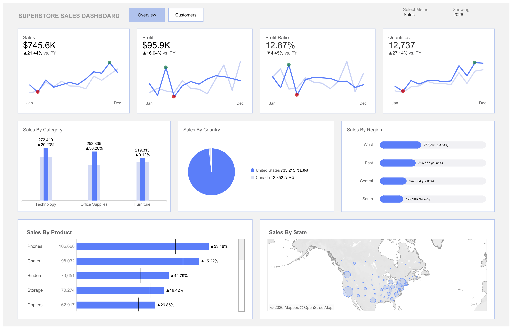
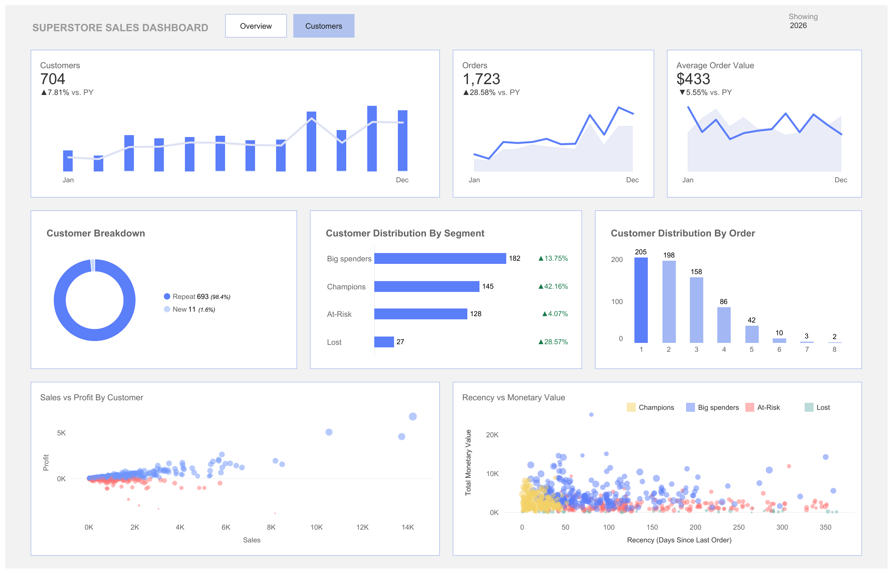

# EU Superstore Sales Analytics
This repository presents an end-to-end analysis of Superstore sales data spanning from 2023 to 2026.
### Repository Structure
- `sample_-_superstore.xls`: [EU Superstore Sales Data](https://public.tableau.com/app/learn/sample-data) provided by Tableau
- `artifact.xlsx`: Customer segment mappings derived from RFM clustering
- `superstore_sales.ipynb`: Python notebook for cleaning, outlier handling, and RFM-based customer segmentation using K-Means clustering
- `Superstore_Sales_Dashboard.twb`: Tableau dashboard with KPI cards, time series, and regional map (published on [Tableau Public](https://public.tableau.com/views/SalesDashboard_17786143791080/Overview))

### Data Preparation & EDA using Python
- Quarterly sales and profit trend
- Profitability by category
- Region-wise performance
- Impact of high discounts on profit
- RFM feature engineering and unsupervised cluster-based customer segmentation

**Insights**
- Strong Q4 seasonality surges are observed across all years.
- Furniture category generates high sales value but low profit margin.
    - Potential cause: Furniture has the highest average discount among all categories.
- Despite outperforming the South region by over $111K in sales, the Central region yielded the lowest profit margin.
- Discounts >20% correlate with net losses.

### Data Visualization & Business Insights using Tableau
**Performance Overview**

- While annual sales reached $746K (up 21% YoY) and order quantities surged by 27% to 12,737 units, the profit ratio dropped by 4% down to 12.87%.
- Technology remains the largest sales driver, followed by Office Supplies which experienced the highest year-over-year growth rate. At the SKU level, Phones and Chairs lead individual product revenue streams.
- Business is heavily centralized within the United States market.

**Customer Insights**

- Revenue heavily relies on customer lifetime value, with repeat buyers making up 98% of total active users.
- The RFM-based customer distribution reveals Big Spenders as the largest cluster. However, there is a segment of At-Risk customers that require targeted retention strategies before they transition into the Lost cohort.
- Transactional patterns uncover that a high volume of users drop off after placing only 1 to 2 orders.